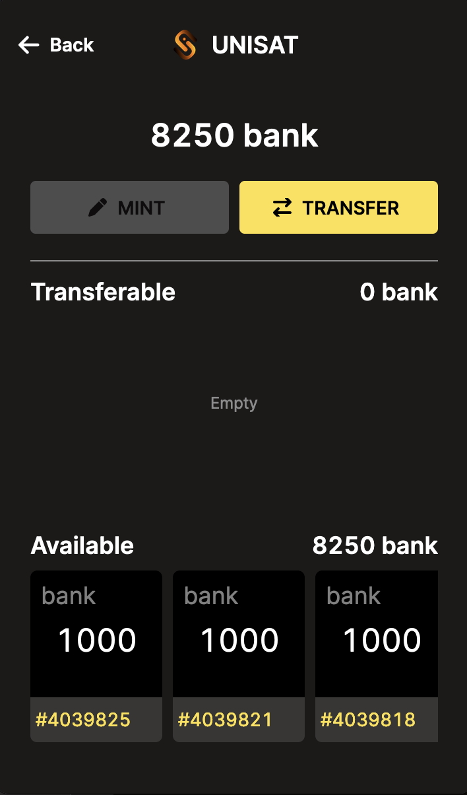

# BSV-20

## Abstract

This proposal introduces a fungible token standard based off of the BRC20[1](./#footnote-1) standard on BTC introduced by Domo [here](https://domo-2.gitbook.io/brc-20-experiment/) but customised to work on BSV (Bitcoin Satoshi Vision). In order to avoid cofusion with the BRC-20 standard on BTC, we are calling this standard BSV-20.

## Motivation

The purpose of this proposal is to provide a standard that offers the same functionality that BRC20-BTC offers that works on BSV instead of BTC. A guiding motivation behind this standard proposal is to try and keep the standard as simple as possible.

## Specification

This specification is meant be as similar to the BTC BRC20 standard so it also follows the 'first is first' approach. In order to deploy or mint a token, the process is almost identical to the protocol on BTC: you would create a transaction output with the data fields below and tranasction are indexed on a 'first is first' approach with duplicates or overflows being invalid and ignored. The main difference between bsv-20 (this protocol) and bsv-20 protocol (on BTC) is:

* A content type of `application/bsv-20` is used in place of `text/plain`. This change means a bsv-20 indexer does not need to parse every text inscription to test for embedded JSON content (and failing most of the time) in order to determine if an inscription is BSV-20 related.

### Notes

Following BRC20 on btc:

* The first deployment of a ticker is the only one that has claim to the ticker. Tickers are not case sensitive (DOGE = doge)
* If two events occur in the same block, prioritization is assigned via order they were confirmed in the block. (first to last)
* The first mint to exceed the maximum supply will receive the fraction that is valid. (ex. 21,000,000 maximum supply, 20,999,242 circulating supply, and 1000 mint inscription = 758 balance state applied)
* Number of decimals cannot exceed 18 (default)
* Standard limited to uint128
* Maximum supply cannot exceed uint64\_max
* the UTXO created is a 1 Satoshi output but is not transferred the same way as regular 1-sat-ordinal inscriptions since transfers will work differently than ordinal transfers

### Deploy

In order to deploy an BSV-20 token, you must make sure that that token ticker has not already been deployed and then create a TXO with the following data present in the script. It does not matter whether this UTXO is spendable or not.

| Key  | Required? | Description                                                        |
| ---- | --------- | ------------------------------------------------------------------ |
| p    | Yes       | Protocol: Helps other systems identify and process bsv-20 events   |
| op   | Yes       | Operation: Type of event (Deploy, Mint, Transfer)                  |
| tick | Yes       | Ticker: 4 letter identifier of the bsv-20                          |
| max  | Yes       | Max supply: set max supply of the bsv-20                           |
| lim  | No        | Mint limit: If letting users mint to themsleves, limit per ordinal |
| dec  | No        | Decimals: set decimal precision, default to 18                     |

#### Example

To deploy the `ordi` token, you would create an inscription with the following json (with `ContentType: application/bsv-20`):

```json
{ 
  "p": "bsv-20",
  "op": "deploy",
  "tick": "ordi",
  "max": "21000000",
  "lim": "1000"
}
```

### Mint

In order to mint tokens of a specific BSV-20 token, you must make sure that that token ticker has already been deployed and then create a UTXO with 1 satoshi value as well as with the following data present in the script. This UTXO should be spendable in order for you to be able to transfer these minted tokens.

| Key  | Required? | Description                                                                                        |
| ---- | --------- | -------------------------------------------------------------------------------------------------- |
| p    | Yes       | Protocol: Helps other systems identify and process bsv-20 events                                   |
| op   | Yes       | Operation: Type of event (Deploy, Mint, Transfer)                                                  |
| tick | Yes       | Ticker: 4 letter identifier of the bsv-20                                                          |
| amt  | Yes       | Amount to mint: States the amount of the bsv-20 to mint. Has to be less than "lim" above if stated |

#### Example

To mint `ordi` tokens, you would create an inscription with the following json (with `ContentType: application/bsv-20`):

```json
{ 
  "p": "bsv-20",
  "op": "mint",
  "tick": "ordi",
  "amt": "1000"
}
```

### Transfer

In order to transfer the minted tokens, all you need to do is to spend that specific UTXO and create new outputs the same way you spend a regular Satoshis in UTXO but instead you would use the value in data `amt` field to specify the amount (instead of the Satoshi field in the transaction output) and create as many outputs as needed.

If more tokens are created in the outputs than are available in the inputs then the transaction is considered invalid and the tokens are considered burnt. If less tokens are created in the outputs than are available in the intput, then the missing tokens are considered burnt.  

You have 2 options for transferring BSV-20 tokens:  

1- Transferring the whole inscription balance (for example, if you've minted 1000 `ordi` tokens and you want to send that whole balance to someone)   
2- Transferring part of an inscription balance (for example, if you've minted 1000 `ordi` tokens and you want to send only 200 of those tokens to someone)


Let's say you've minted 1000 `bank` tokens 3 times (as seen in image below). Your options are to either send one of the whole 1000 tokens to someone (option 1 below) or split that up and send send part of the 1000 tokens, let's say 200 tokens, to someone (option 2 below).

<figure><figcaption></figcaption></figure>

#### 1- Transferring whole inscription balance

To transfer the whole inscriptino balance, you just simple transfer the inscribed ordinal regularly (the same way you would send any other inscription/inscribed ordinal) to someone else. This also works with [ordinal-lock](Ordinal-Lock.md) - and if you cancel a specific ordinal-lock transaction then the tokens would go back to the original owner.

#### 2- Transferring part of inscription balance

In order to transfer a subset/part of the inscription balance (for example, sending only 400 of the minted or received 1000 tokens), you must follow the procedure described below:  

Using the same procedure as regular Satoshi transfers allows us to benefit from the parallelisation that regular Satoshis in Bitcoin benefit from where you can split a specific UTXO with a large amount into smaller UTXOs and spend those in parallel (the same way you could exchange a $100 bill into $1 bills and spend those in parallel) with no sequential bottlenecks that something like ERC20 sufffers from.

Please note that with BSV-20 (unlike with BRC-20 on BTC) the process is only 1 step not 2 steps - you don't need to move tokens to a "transferrable" balance. This provides a better user experience and avoids issues associated with indexing (especially at scale).

| Key  | Required? | Description                                                      |
| ---- | --------- | ---------------------------------------------------------------- |
| p    | Yes       | Protocol: Helps other systems identify and process bsv-20 events |
| op   | Yes       | Operation: Type of event (Deploy, Mint, Transfer)                |
| tick | Yes       | Ticker: 4 letter identifier of the bsv-20                        |
| amt  | Yes       | Amount to transfer: States the amount of the bsv-20 to transfer. |

#### Example

To transfer the `ordi` tokens that you minted as shown above, you would create a transaction spending the minting UTXO (providing the signature and public key normally to spend the P2PKH script) with an output (or many) with similar scripts with the following json (with `ContentType: application/bsv-20`), as shown below:

To mint `ordi` tokens, you would create an inscription with the following json:

```json
{ 
  "p": "bsv-20",
  "op": "transfer",
  "tick": "ordi",
  "amt": "1000"
}
```

| Inputs                                              | Outputs                                                                 |
| --------------------------------------------------- | ----------------------------------------------------------------------- |
| Signature Public\_key (spending mint of 1000 ordis) | inscription(`{"p":"bsv-20","op":"transfer","tick":"ordi","amt":"100"}`) |
|                                                     | inscription(`{"p":"bsv-20","op":"transfer","tick":"ordi","amt":"500"}`) |
|                                                     | inscription(`{"p":"bsv-20","op":"transfer","tick":"ordi","amt":"400"}`) |

## Implementations

> The Implementations section should contain information about places where the standard is implemented, or examples of its implementation.

## Grandfathering in older inscriptions

There are several inscriptions on the blockchain prior to the release of this spec that use `text/plain` as the content type instead of `application/bsv-20`. We will continue to index these up to block height `793000`. Starting with this block, BSV-20 inscriptions must have a content type of `application/bsv-20` to be considered valid by indexers.

## References

* 1: [BRC20 on BTC](https://domo-2.gitbook.io/brc-20-experiment/)
