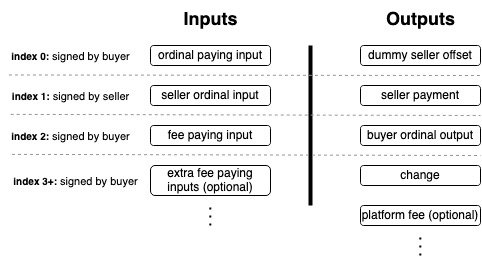

# Partially Signed Bitcoin Transactions (PSBTs)

## Listing an Ordinal for Sale
You can create a PSBT to list a specific ordinal that you own for sale at a specific price where someone else can trustlessly complete the partially signed transaction with their inputs to pay the lsited amount as well as their output script which the ordinal will be sent to. Code to do this can be found here: https://github.com/libsv/go-bt/blob/master/ord/listing.go  

This can allow for a Dutch auction where the seller can start at a price and keep decreasing until someone takes the offer.  

To list an ordinal for sale, you just create a new Bitcoin transaction with 1 input (your ordinal utxo) and 1 output (where you want your payment to go with the listing amount) and sign with `SIGHASH_SIGNLE | SIGHASHANYONECANPAY` (using forkID). Here is an example:

```json
{
    "hex": "01000000016aced9aba38603b99a6660aaeed4119ced36540ed9e165c16ae41a36b17f028f000000006a47304402205fc9ee0da1e12bf4774394018d23d9af620c9305c1587e681736eb1ef3aada2802200c83332407230c9a0825bc39c317002f8cd8652ff847e0ba476296476ae515ffc32103b5a2ed046a33eeb504cbdd0aab9737f61a1b48178b284f40ae32b5efb71b89d4ffffffff01e8030000000000001976a9147921b5e173f5f664f566a9cd9514a1d0d85a76b688ac00000000",
    "txid": "2dc3853fd73e8c1d8bee503b45337c36d9c8d89795db9d692ba936501295bee9",
    "hash": "2dc3853fd73e8c1d8bee503b45337c36d9c8d89795db9d692ba936501295bee9",
    "size": 191,
    "version": 1,
    "locktime": 0,
    "vin": [
        {
            "n": 0,
            "txid": "8f027fb1361ae46ac165e1d90e5436ed9c11d4eeaa60669ab90386a3abd9ce6a",
            "vout": 0,
            "scriptSig": {
                "asm": "304402205fc9ee0da1e12bf4774394018d23d9af620c9305c1587e681736eb1ef3aada2802200c83332407230c9a0825bc39c317002f8cd8652ff847e0ba476296476ae515ffc3 03b5a2ed046a33eeb504cbdd0aab9737f61a1b48178b284f40ae32b5efb71b89d4",
                "hex": "47304402205fc9ee0da1e12bf4774394018d23d9af620c9305c1587e681736eb1ef3aada2802200c83332407230c9a0825bc39c317002f8cd8652ff847e0ba476296476ae515ffc32103b5a2ed046a33eeb504cbdd0aab9737f61a1b48178b284f40ae32b5efb71b89d4",
                "isTruncated": false
            },
            "sequence": 4294967295,
            "voutDetails": {
                "value": 1e-8,
                "n": 0,
                "scriptPubKey": {
                    "asm": "OP_DUP OP_HASH160 c25e9a2b70ec83d7b4fbd0f36f00a86723a48e6b OP_EQUALVERIFY OP_CHECKSIG OP_FALSE OP_IF 6f7264 OP_TRUE 746578742f706c61696e3b636861727365743d7574662d38 OP_FALSE 48656c6c6f2c20776f726c6421 OP_ENDIF",
                    "hex": "76a914c25e9a2b70ec83d7b4fbd0f36f00a86723a48e6b88ac0063036f72645118746578742f706c61696e3b636861727365743d7574662d38000d48656c6c6f2c20776f726c642168",
                    "type": "nonstandard",
                    "isTruncated": false
                },
                "scripthash": "0a45a232478e6e97f88487433fdb762eca3d8346174ec925f3d6d898e9764afc"
            }
        }
    ],
    "vout": [
        {
            "value": 0.00001,
            "n": 0,
            "scriptPubKey": {
                "asm": "OP_DUP OP_HASH160 7921b5e173f5f664f566a9cd9514a1d0d85a76b6 OP_EQUALVERIFY OP_CHECKSIG",
                "hex": "76a9147921b5e173f5f664f566a9cd9514a1d0d85a76b688ac",
                "reqSigs": 1,
                "type": "pubkeyhash",
                "addresses": [
                    "1C3V9TTJefP8Hft96sVf54mQyDJh8Ze4w4"
                ],
                "isTruncated": false
            },
            "scripthash": "80bd9afab38010571221a07495ba4601d052e8f5170c7fe9b076c5709f551a3a"
        }
    ],
    "vincount": 1,
    "voutcount": 1,
    "vinvalue": 1e-8,
    "voutvalue": 0.00001,
    "isUnknown": true
}
```

Note that it doesn't really matter what index the ordinal input and ordinal seller recieve output are at but they just need to be at the same index. This is why it's not a problem that they're at index 0 in the above partially signed tx but then will move to another index (usually index #1) later on.  

To accept the offer, you need to have at least 2 UTXOs to spend, with at least one of them being strictly greater than the amount that the ordinal is listed for sale at, since that will be used as the first input of the tx and then will pass through the leftover sats into a dummy output at index 0. For example, if the ordinal is listed for sale at 10,000 sats, then could use a UTXO of 11,000 sats and then the first (dummy) output of the finalised tx will contain 1,000 sats and the second will contain the requested 10,000 sats. This will ensure that the satoshi offsets will be consistent so that the third output can contain the new address of the ordinal being sold. Then you just need 1 (or more) other UTXOs to pay for the tx, which will be appended to the inputs and outputs (along with an optional platform fee). Then you sign the rest of the inputs regularly (`SIGHASH_ALL`).

```json
{
    "hex": "0100000003d199b5df17dc8bff9961c5bd38b299df3e3e8d0281030750575e27a4d15cc5fc030000006b48304502210080da8700657f22167811b7f7ea17253377373676735b63c63354d1c77e59a3c20220205eb1b5363353567dddb64ce4337fec3512665878e6d68326da0294b02aaccf412103b5a2ed046a33eeb504cbdd0aab9737f61a1b48178b284f40ae32b5efb71b89d4ffffffff6aced9aba38603b99a6660aaeed4119ced36540ed9e165c16ae41a36b17f028f000000006a47304402205fc9ee0da1e12bf4774394018d23d9af620c9305c1587e681736eb1ef3aada2802200c83332407230c9a0825bc39c317002f8cd8652ff847e0ba476296476ae515ffc32103b5a2ed046a33eeb504cbdd0aab9737f61a1b48178b284f40ae32b5efb71b89d4ffffffff6aced9aba38603b99a6660aaeed4119ced36540ed9e165c16ae41a36b17f028f010000006b483045022100a23ed4e8679ac6b9ed38411cb280e7e74100daeab87a380b44396d5259c6a65902200afe94e294b0c916df0ec0e82a4b6f65f068f5fe93df553ccbc26eac9ca6a904412103b5a2ed046a33eeb504cbdd0aab9737f61a1b48178b284f40ae32b5efb71b89d4ffffffff04e9670000000000001976a9145bd9baf4dc6270bad6e4152363bbeca2f5abc7c488ace8030000000000001976a9147921b5e173f5f664f566a9cd9514a1d0d85a76b688ac01000000000000001976a914b69e544cbf33c4eabdd5cf8792cd4e53f5ed6d1788ac9c030000000000001976a9145bd9baf4dc6270bad6e4152363bbeca2f5abc7c488ac00000000",
    "txid": "4e2c05bd085da96078e8d17a325a60cb38a93e5ec10ef82137192b49629753d5",
    "hash": "4e2c05bd085da96078e8d17a325a60cb38a93e5ec10ef82137192b49629753d5",
    "size": 589,
    "version": 1,
    "locktime": 0,
    "vin": [
        {
            "n": 0,
            "txid": "fcc55cd1a4275e5750070381028d3e3edf99b238bdc56199ff8bdc17dfb599d1",
            "vout": 3,
            "scriptSig": {
                "asm": "304502210080da8700657f22167811b7f7ea17253377373676735b63c63354d1c77e59a3c20220205eb1b5363353567dddb64ce4337fec3512665878e6d68326da0294b02aaccf41 03b5a2ed046a33eeb504cbdd0aab9737f61a1b48178b284f40ae32b5efb71b89d4",
                "hex": "48304502210080da8700657f22167811b7f7ea17253377373676735b63c63354d1c77e59a3c20220205eb1b5363353567dddb64ce4337fec3512665878e6d68326da0294b02aaccf412103b5a2ed046a33eeb504cbdd0aab9737f61a1b48178b284f40ae32b5efb71b89d4",
                "isTruncated": false
            },
            "sequence": 4294967295,
            "voutDetails": {
                "value": 0.00027601,
                "n": 3,
                "scriptPubKey": {
                    "asm": "OP_DUP OP_HASH160 5bd9baf4dc6270bad6e4152363bbeca2f5abc7c4 OP_EQUALVERIFY OP_CHECKSIG",
                    "hex": "76a9145bd9baf4dc6270bad6e4152363bbeca2f5abc7c488ac",
                    "reqSigs": 1,
                    "type": "pubkeyhash",
                    "addresses": [
                        "19NfKd8aTwvb5ngfP29RxgfQzZt8KAYtQo"
                    ],
                    "isTruncated": false
                },
                "scripthash": "0fcf4d75e02c6256453412ed2bcf5a34f5ce03fe58967a2241cfe341c269fb57"
            }
        },
        {
            "n": 1,
            "txid": "8f027fb1361ae46ac165e1d90e5436ed9c11d4eeaa60669ab90386a3abd9ce6a",
            "vout": 0,
            "scriptSig": {
                "asm": "304402205fc9ee0da1e12bf4774394018d23d9af620c9305c1587e681736eb1ef3aada2802200c83332407230c9a0825bc39c317002f8cd8652ff847e0ba476296476ae515ffc3 03b5a2ed046a33eeb504cbdd0aab9737f61a1b48178b284f40ae32b5efb71b89d4",
                "hex": "47304402205fc9ee0da1e12bf4774394018d23d9af620c9305c1587e681736eb1ef3aada2802200c83332407230c9a0825bc39c317002f8cd8652ff847e0ba476296476ae515ffc32103b5a2ed046a33eeb504cbdd0aab9737f61a1b48178b284f40ae32b5efb71b89d4",
                "isTruncated": false
            },
            "sequence": 4294967295,
            "voutDetails": {
                "value": 1e-8,
                "n": 0,
                "scriptPubKey": {
                    "asm": "OP_DUP OP_HASH160 c25e9a2b70ec83d7b4fbd0f36f00a86723a48e6b OP_EQUALVERIFY OP_CHECKSIG OP_FALSE OP_IF 6f7264 OP_TRUE 746578742f706c61696e3b636861727365743d7574662d38 OP_FALSE 48656c6c6f2c20776f726c6421 OP_ENDIF",
                    "hex": "76a914c25e9a2b70ec83d7b4fbd0f36f00a86723a48e6b88ac0063036f72645118746578742f706c61696e3b636861727365743d7574662d38000d48656c6c6f2c20776f726c642168",
                    "type": "nonstandard",
                    "isTruncated": false
                },
                "scripthash": "0a45a232478e6e97f88487433fdb762eca3d8346174ec925f3d6d898e9764afc"
            }
        },
        {
            "n": 2,
            "txid": "8f027fb1361ae46ac165e1d90e5436ed9c11d4eeaa60669ab90386a3abd9ce6a",
            "vout": 1,
            "scriptSig": {
                "asm": "3045022100a23ed4e8679ac6b9ed38411cb280e7e74100daeab87a380b44396d5259c6a65902200afe94e294b0c916df0ec0e82a4b6f65f068f5fe93df553ccbc26eac9ca6a90441 03b5a2ed046a33eeb504cbdd0aab9737f61a1b48178b284f40ae32b5efb71b89d4",
                "hex": "483045022100a23ed4e8679ac6b9ed38411cb280e7e74100daeab87a380b44396d5259c6a65902200afe94e294b0c916df0ec0e82a4b6f65f068f5fe93df553ccbc26eac9ca6a904412103b5a2ed046a33eeb504cbdd0aab9737f61a1b48178b284f40ae32b5efb71b89d4",
                "isTruncated": false
            },
            "sequence": 4294967295,
            "voutDetails": {
                "value": 0.00000953,
                "n": 1,
                "scriptPubKey": {
                    "asm": "OP_DUP OP_HASH160 c25e9a2b70ec83d7b4fbd0f36f00a86723a48e6b OP_EQUALVERIFY OP_CHECKSIG",
                    "hex": "76a914c25e9a2b70ec83d7b4fbd0f36f00a86723a48e6b88ac",
                    "reqSigs": 1,
                    "type": "pubkeyhash",
                    "addresses": [
                        "1JijRHzVfub38S2hizxkxEcVKQwuCTZmxJ"
                    ],
                    "isTruncated": false
                },
                "scripthash": "e0ffcbc657e1b1d3de0890cca60740484257d56f5cac936897391469ce8c8c4a"
            }
        }
    ],
    "vout": [
        {
            "value": 0.00026601,
            "n": 0,
            "scriptPubKey": {
                "asm": "OP_DUP OP_HASH160 5bd9baf4dc6270bad6e4152363bbeca2f5abc7c4 OP_EQUALVERIFY OP_CHECKSIG",
                "hex": "76a9145bd9baf4dc6270bad6e4152363bbeca2f5abc7c488ac",
                "reqSigs": 1,
                "type": "pubkeyhash",
                "addresses": [
                    "19NfKd8aTwvb5ngfP29RxgfQzZt8KAYtQo"
                ],
                "isTruncated": false
            },
            "scripthash": "0fcf4d75e02c6256453412ed2bcf5a34f5ce03fe58967a2241cfe341c269fb57"
        },
        {
            "value": 0.00001,
            "n": 1,
            "scriptPubKey": {
                "asm": "OP_DUP OP_HASH160 7921b5e173f5f664f566a9cd9514a1d0d85a76b6 OP_EQUALVERIFY OP_CHECKSIG",
                "hex": "76a9147921b5e173f5f664f566a9cd9514a1d0d85a76b688ac",
                "reqSigs": 1,
                "type": "pubkeyhash",
                "addresses": [
                    "1C3V9TTJefP8Hft96sVf54mQyDJh8Ze4w4"
                ],
                "isTruncated": false
            },
            "scripthash": "80bd9afab38010571221a07495ba4601d052e8f5170c7fe9b076c5709f551a3a"
        },
        {
            "value": 1e-8,
            "n": 2,
            "scriptPubKey": {
                "asm": "OP_DUP OP_HASH160 b69e544cbf33c4eabdd5cf8792cd4e53f5ed6d17 OP_EQUALVERIFY OP_CHECKSIG",
                "hex": "76a914b69e544cbf33c4eabdd5cf8792cd4e53f5ed6d1788ac",
                "reqSigs": 1,
                "type": "pubkeyhash",
                "addresses": [
                    "1HebepswCi6huw1KJ7LvkrgemAV63TyVUs"
                ],
                "isTruncated": false
            },
            "scripthash": "92e62914849ff4c0f77b84aa361aba4a70365525a220912385388aa5d0c99559"
        },
        {
            "value": 0.00000924,
            "n": 3,
            "scriptPubKey": {
                "asm": "OP_DUP OP_HASH160 5bd9baf4dc6270bad6e4152363bbeca2f5abc7c4 OP_EQUALVERIFY OP_CHECKSIG",
                "hex": "76a9145bd9baf4dc6270bad6e4152363bbeca2f5abc7c488ac",
                "reqSigs": 1,
                "type": "pubkeyhash",
                "addresses": [
                    "19NfKd8aTwvb5ngfP29RxgfQzZt8KAYtQo"
                ],
                "isTruncated": false
            },
            "scripthash": "0fcf4d75e02c6256453412ed2bcf5a34f5ce03fe58967a2241cfe341c269fb57"
        }
    ],
    "vincount": 3,
    "voutcount": 4,
    "vinvalue": 0.00028555,
    "voutvalue": 0.00028526,
    "isUnknown": true
}
```

## Making a bid for an Ordinal
You can create a PSBT to bid at a specific price for a specific ordinal that someone else owns where they can accept the bid truslessly by completing the partially signed transaction. Code to do this can be found here: https://github.com/libsv/go-bt/blob/master/ord/bidding.go  

To bid at a price for a specific ordinal, you just create a new Bitcoin transaction (similar to the one above) but backwards.  

You add you payment input (which needs to be strict greater than the bid amount), then the ordinal input, then your fee paying input(s); 1 dummy output (equal to the amount of the payment input minus the amount being bid to the seller), then dummy seller receive output with the bid amount, then your receive output for the ordinal, then the change and platform fees. Then you sign all inputs except for the ordinal input (at index #1) with `SIGHASH_SIGNLE` (using forkID). Here is an example:

```json
{
    "hex": "010000000340907f433e82ed6bbe5d685cdd4c1086d680b270af2d93d81cae2668b4c0e0e3000000006b483045022100fdb7278ca4a4484d0500c8305419ddd598b385dced2af39e28e75f85a6ab1c7e0220272ab264f03e9abd460444deb1a0fb1d6f854fa79a6cb1fd94b69e0db1a28bbd432103b5a2ed046a33eeb504cbdd0aab9737f61a1b48178b284f40ae32b5efb71b89d4ffffffffad81acf4f629dbafd9a105b8beacae9fc68426a4db19e4a594f06101fd4fe27500000000000000000088b543bfbd60306b44aa73735bd36bf14325dd71a19f82e4dee26c99c622ab44000000006a473044022067a009b3b3b7d67c59001eaea82ac70563cb7aae58a45d268beabb2f0b7e9848022070f4319f0b6a9123acb31a9ef802d90704938a114d499dfd88b629d45aa37f9a432103b5a2ed046a33eeb504cbdd0aab9737f61a1b48178b284f40ae32b5efb71b89d4ffffffff0490010000000000001976a9145bd9baf4dc6270bad6e4152363bbeca2f5abc7c488acf4010000000000001976a91402d1e3d3567a88e0cfd13f57167238c4eb7c813888ac01000000000000001976a9140f83a353705d800d13146bf4ad90510cc057a8d588acd6010000000000001976a9145bd9baf4dc6270bad6e4152363bbeca2f5abc7c488ac00000000",
    "txid": "e465281519b672a86c57d6960c49c044248c2fca41ddc331e10dcef2941fd6ab",
    "hash": "e465281519b672a86c57d6960c49c044248c2fca41ddc331e10dcef2941fd6ab",
    "size": 482,
    "version": 1,
    "locktime": 0,
    "vin": [
        {
            "n": 0,
            "txid": "e3e0c0b46826ae1cd8932daf70b280d686104cdd5c685dbe6bed823e437f9040",
            "vout": 0,
            "scriptSig": {
                "asm": "3045022100fdb7278ca4a4484d0500c8305419ddd598b385dced2af39e28e75f85a6ab1c7e0220272ab264f03e9abd460444deb1a0fb1d6f854fa79a6cb1fd94b69e0db1a28bbd43 03b5a2ed046a33eeb504cbdd0aab9737f61a1b48178b284f40ae32b5efb71b89d4",
                "hex": "483045022100fdb7278ca4a4484d0500c8305419ddd598b385dced2af39e28e75f85a6ab1c7e0220272ab264f03e9abd460444deb1a0fb1d6f854fa79a6cb1fd94b69e0db1a28bbd432103b5a2ed046a33eeb504cbdd0aab9737f61a1b48178b284f40ae32b5efb71b89d4",
                "isTruncated": false
            },
            "sequence": 4294967295,
            "voutDetails": {
                "value": 0.000009,
                "n": 0,
                "scriptPubKey": {
                    "asm": "OP_DUP OP_HASH160 c25e9a2b70ec83d7b4fbd0f36f00a86723a48e6b OP_EQUALVERIFY OP_CHECKSIG",
                    "hex": "76a914c25e9a2b70ec83d7b4fbd0f36f00a86723a48e6b88ac",
                    "reqSigs": 1,
                    "type": "pubkeyhash",
                    "addresses": [
                        "1JijRHzVfub38S2hizxkxEcVKQwuCTZmxJ"
                    ],
                    "isTruncated": false
                },
                "scripthash": "e0ffcbc657e1b1d3de0890cca60740484257d56f5cac936897391469ce8c8c4a"
            }
        },
        {
            "n": 1,
            "txid": "75e24ffd0161f094a5e419dba42684c69faeacbeb805a1d9afdb29f6f4ac81ad",
            "vout": 0,
            "scriptSig": {
                "asm": "",
                "hex": "",
                "isTruncated": false
            },
            "sequence": 0,
            "voutDetails": {
                "value": 1e-8,
                "n": 0,
                "scriptPubKey": {
                    "asm": "OP_DUP OP_HASH160 fabef78de0d136d0f9b13f047312fc4df094da9c OP_EQUALVERIFY OP_CHECKSIG OP_FALSE OP_IF 6f7264 OP_TRUE 696d6167652f706e67 OP_FALSE 89504e470d0a1a0a0000000d4948445200000180000001800806000000a4c7b5bf00000006624b474400ff00ff00ffa0bda79300000e8449444154789cedddfb93ddf55dc7f1b339bb9b4d36091b2021d484d2909f8ab6dafa030816158233b6462c6da509f710508142200912728329500a4941e496001129424ba1741cb5b5056d404b2df687d21116103b4d099799e5127673367b76cffa47bc985977de8fc7ef2fce59f6ec79e6fbcbe7d3680000000000000000000000000000000000000000000000001fb4aea97e034cad93ffe094c9643fd988e68da79e7a32fa0c7efa8f3e13bd81f787df4fe68d3d7b7e18bdffe5a79c1abdffd183a3c9bcf1f4d37b7c07143663aadf0000534300008a120080a20400a0280100284a00008a120080a20400a0280100284a00008a120080a20400a0280100284a00008a120080a29c053ec53ef9c9df8ece83efede98d5e7ff7ee07a27d57f8115a7dc179d1fe6f77ff5db49f9cccee33b8f892bf88f637dfbc3dda0f0c0c44fb95abce88f6e917c833fffe8cefa029e40900a0280100284a00008a120080a20400a0280100284a00008a120080a20400a0280100284a00008a120080a20400a0280100284a00008aea9eea37b060c182e840f6fefe39d1ebffe217ff1b9d47fed18f1e1bbdff8bfff29264def8d0877e2dda5f78d105d17ef3a6add1be6f565fb4efe9ed89f66f0f0d45fbb1f658b43f78f060b45f159ee77fdbadb747fbd75e7b2ddabfb77f63f4f7f3fcf33f8bfe7e972d5b16bdfe8c19cd64de78e9a5c129bd0fc11300405102005094000014250000450900405102005094000014250000450900405102005094000014250000450900405102005094000014159f457dc8218744e7699f78e2ef46afff918f2c8df64f3df983687fdd755f8ef6ed763bdadff6d7b746fb679ffd51f41938e9532745bfff6677762545dfccec3e8103ad03d1be199e07dfdd93fdfcdffbde77a3dfdf09279c18fdfed6afbb2a9937dae17d0ad7df90fdfd9dbafcd468fff2cb2f47fb1f3dfb1fd1fe8d37de887eff9e00008a120080a20400a0280100284a00008a120080a20400a0280100284a00008a120080a20400a0280100284a00008a120080a20400a0a8f83e80d4c0c040741ef9e74eff7cf4fa73e7ce8bf64b9766f711dc7fffbdd1beab2bfb15ce9f7f68b4df78f535d17ecbb6cdd1bebfbf3fda4f8c8f47fb76b87fe8eb0f47fb73ce392bda0f8f0c47fbf43e8b73ce3e37da2f5c7844b47feeb9ff8cf68f7c23fbfdeddbb76f4abf833d0100142500004509004051020050940000142500004509004051020050940000142500004509004051020050940000142500004509004051537e1f406ac9e225d17d022bfee4b4e8f5bffffd7f89f63d3d3dd17efdbaaba2fdb265cba2fdd51bb3d7ef9f1d9ee73f3111edbb7bbaa3fd783bbb0f20fd0bdcb5f3be68ff3fafbc12edaf5c7f45b41f0fef13b8ecb2b5d17ec7d7b647fb175ef8ef69fd1dea0900a0280100284a00008a120080a20400a0280100284a00008a120080a20400a0280100284a00008a120080a20400a0280100284a00008aca0e43ff7f203dcffdc8458ba2fdb6add746fb77de7927daefdc7957b4ef4c46d7293476dd736fb4bfe4d28ba3fd64237bff5d5dd971ee336664ff867af49b8f45fb15a77d26dab7c7c6a2fd9d77dc1ded878686a2fdcf7ffe7cb41f1d1d8df6d39d270080a20400a0280100284a00008a120080a20400a0280100284a00008a120080a20400a0280100284a00008a120080a20400a0280100286adadf07303e3e1eedd3f3c87b7a7aa3fd830f3e10ede7ce9b17edaffff20dd1fef0c31744fbd9b36747fbf787df8ff6e97d02ad562bdabff1e61bd17ef3a6add17ee3357f15edd76fb832da9f7fdeea681f5ee7d0e8edcdfe7ea73b4f00004509004051020050940000142500004509004051020050940000142500004509004051020050940000142500004509004051020050d4b4bf0fa06f665fb43ffcf0c3a3fda2458ba2fdecfefe68df6c36a37d7a1efa9967ad8cf6add1ec3cfdf4e70faf0368f487bfbff3579f1bedefdd797fb44fdf7f7a1fc7c4c444b43fe288ecefaf3a4f00004509004051020050940000142500004509004051020050940000142500004509004051020050940000142500004509004051020050d4b4bf0f60786424dacf9a353bdaefdfbf3fdab70e1c88f6dbb65e17ed3b9dec40fc6ddbae8df637dc787db41f1e1e8ef6139dec3cfa766b2cda3ff6ad27a2fd2bafbc1cedd3cfcf359bae8ef6b36767f711bcf7debbd1be3d96fdfea63b4f00004509004051020050940000142500004509004051020050940000142500004509004051020050940000142500004509004051020050d4b4bf0fa0afaf2fda8f1cc8ee1378e8a1af47fb175f7ca12bd96fde724d74a07f7f7f761e7b7777f611ea743ad1bed96c46fb59b36645fbce44f6fe3ff7f93f8df6b3c3fb2cde7e7b28daffe4b99f449fdf919191e8f3bbf6f22b9279637232bb0f63baf304005094000014250000450900405102005094000014250000450900405102005094000014250000450900405102005094000014250000454dfbfb00daed76b41f1acace43ef09cfc33ff6d85f8f0e24ffca8d3745af3f7ffea1d17ee1c285d1feadb7de8af61ffb8d8f45fbbd7b7f19ed7b67ce8cf6edb1ecf3fbdefef7a2fdfc81f9d17ed5995f8c3ebfe9fb6fb55ad17e46b3f6bf816bfff4008509004051020050940000142500004509004051020050940000142500004509004051020050940000142500004509004051020050d494df07b060c1c2e83cf1952b5745af7fe4a223a3fdc4c444b44fcf931f08cf736f369bd1fec5175f8cf61f3eeaa8687ff2f2df8ff6a9fb76ed8ef6938de8e3df38e28845d1fedd77df89f6cdeeecf3d31d7efede7cebcd687fc5da75d17efb8e9ba35fe0abafbeda15bd8190270080a20400a0280100284a00008a120080a20400a0280100284a00008a120080a20400a0280100284a00008a120080a20400a0280100282a3e8bfab0c30e8bcec33ee18413a3d74fcfa33f75f9a9d1fee31fffcd687fef7dbba27d4f774fb44f3f01b3fa6645fb894e769f425757f603743a9d689fea84f7494c66d709c4f7110c0f0f47fbad5bb645fbc1c1c168bfebde9dd1feb8e38e8ff64f3ef98368fffaebfba23f004f000045090040510200509400001425000045090040510200509400001425000045090040510200509400001425000045090040510200505477fa1f181a1a8acea37efae93dd181e4871e7a68326f2c5ebc24daefd8714bb4dfbefd6bd1fe9a4d1ba3fd2d376f8ff603870c44fba38efa70b46fb55ad17ed1914746fb919191687f707434da379bcd687fda675744fbf5eb3644fb2d5b3645fb73cf3d3fdab7db63d1fe99a7f744fbf43cff94270080a20400a0280100284a00008a120080a20400a0280100284a00008a120080a20400a0280100284a00008a120080a20400a0280100282abe0f203567cedc68bf7cf91f46fbd1d1ec3cf9f1898968bf65ebe668dfdbdb1bedd3fb10d6acc9ce63ef9a91fd1be4d16f3c16ed0f1e3c18ed57acf874b46f84a7c13fb0fbc1689f7e7eeeb9e7ae68df13befedcb9d9f7c7972ebd3cdadf7adb8e683fd53c0100142500004509004051020050940000142500004509004051020050940000142500004509004051020050940000142500004509004051f17d0073e6cc994cf6471f7d74f4fa4f3cf178b4df78f5a6689fbafcb2b5d17efb8e5ba27dab95dd8730d66e47fb7ff8ce3f46fb2ffcd9e9d13e3d8ffedb8f7f27daaf3aeb8bd1bed9dd8cf65de185046bd75e19ed376fc9fefefafa6645fbf43cff157f7c5ab4fff6138f47df9ffbf6bd16fd023d0100142500004509004051020050940000142500004509004051020050940000142500004509004051020050940000142500004509004051f17d00e979dc4b162f89f6fbf6ed8bf677dcf937d17efdba0dd17e71f8f3cf9b3b37da5ff4e76ba27d7a1efeca556744fbf6f878b4ef74a2e3d81b67acfc42b47ffc5b4f44fbcf9e9e9d473fd61e8bf6232323d17edbd6eba2fda64d5747fb836307a3fdde5fed8df693939d689ff20400509400001425000045090040510200509400001425000045090040510200509400001425000045090040510200509400001425000045754df51b58b278497420fbde5fed8d7e8663961e13bdfecc99339379e3908181683fda6a45fb471e7934dabffefaebd1fe2b5fb921da4f7426a27da7939dc7dedbdb1bedefbe6b67b41f1c1c8cf6377df5c6683fdeceee63d8fffefe68dfd5957d85fdf4a7ff15fd07962c392afbfedafbcb29fd0ef60400509400001425000045090040510200509400001425000045090040510200509400001425000045090040510200509400001425000045754ff51b88cff33f263bcfffbc73cf4fe68d471ffd66b44fedda757fb4bff0a20ba2fde464f4bfbff1c0ee07a3fdea35e745fbee66f62770fb6d7744fb3517ae8ef6fbf767e7e96fdb7a6db4bff6daadd1bea7a727da9f75e6d9d17e646438fa000f0e0e4ef99d2a094f00004509004051020050940000142500004509004051020050940000142500004509004051020050940000142500004509004051020050d4b43ecbfa83b07469769fc0a5977c297afdf43cf4871ffefb68bf61c355d1fe778e3f21da9f7dce99d1fe9fbffb4f53fa193ee5e4e5d1e7e7a69b6e8e5e7f4eff9c689fdea7b07edd8668dfe974a2fd96ad9ba3fdf3cfffacf477a0270080a20400a0280100284a00008a120080a20400a0280100284a00008a120080a20400a0280100284a00008a120080a20400a028010028aaf459d81f844ffcd627a2f3e02fbef8d2e8f5efbefbce683f77debc68df887efa46e3a97f7db2f467f0a44ffd5ef47f70ac3d16bd7e734633dadf72cb8e68bfe6c2d5d1befa79fe294f0000450900405102005094000014250000450900405102005094000014250000450900405102005094000014250000450900405102005054f754bf81e9ee40eb40b46fb55ad1fef6dbb3fb002ebb3cbb8fe0c73f7ed679ec811feef9b7e8ffdff1c71d1fdd27909ee7ffd24b83d1bebb3bbb8f808c270080a20400a0280100284a00008a120080a20400a0280100284a00008a120080a20400a0280100284a00008a120080a20400a028010028eaff0080a891cbdf3cd1d00000000049454e44ae426082 OP_ENDIF OP_RETURN 3150755161374b36324d694b43747373534c4b79316b683536575755374d74555235 534554 74797065 6f7264 636f6c6c656374696f6e 734d6f6e2053696e6e657273 617070 74616c656f6673687561 6d6f6e54797065 6372656174757265 617564696f 623a2f2f33313961613834616532333266383835373535363161636632323430326634356166326130653761646531323262353635316662393663303335616164353130 7374617473 7b22737472656e677468223a312c22766974616c697479223a332c226167696c697479223a322c22696e74656c6c6967656e6365223a342c226c75636b223a342c22737069726974223a357d 67756964 33656330663636302d643437632d313165642d396530662d383533326432366561383238 73696e 7072696465 6e6174757265 776174636866756c 72616365 6669656e64 6e616d65 576174636866756c204669656e64206f66205072696465",
                    "hex": "76a914fabef78de0d136d0f9b13f047312fc4df094da9c88ac0063036f72645109696d6167652f706e67004dcf0e89504e470d0a1a0a0000000d4948445200000180000001800806000000a4c7b5bf00000006624b474400ff00ff00ffa0bda79300000e8449444154789cedddfb93ddf55dc7f1b339bb9b4d36091b2021d484d2909f8ab6dafa030816158233b6462c6da509f710508142200912728329500a4941e496001129424ba1741cb5b5056d404b2df687d21116103b4d099799e5127673367b76cffa47bc985977de8fc7ef2fce59f6ec79e6fbcbe7d3680000000000000000000000000000000000000000000000001fb4aea97e034cad93ffe094c9643fd988e68da79e7a32fa0c7efa8f3e13bd81f787df4fe68d3d7b7e18bdffe5a79c1abdffd183a3c9bcf1f4d37b7c07143663aadf0000534300008a120080a20400a0280100284a00008a120080a20400a0280100284a00008a120080a20400a0280100284a00008a120080a29c053ec53ef9c9df8ece83efede98d5e7ff7ee07a27d57f8115a7dc179d1fe6f77ff5db49f9cccee33b8f892bf88f637dfbc3dda0f0c0c44fb95abce88f6e917c833fffe8cefa029e40900a0280100284a00008a120080a20400a0280100284a00008a120080a20400a0280100284a00008a120080a20400a0280100284a00008aea9eea37b060c182e840f6fefe39d1ebffe217ff1b9d47fed18f1e1bbdff8bfff29264def8d0877e2dda5f78d105d17ef3a6add1be6f565fb4efe9ed89f66f0f0d45fbb1f658b43f78f060b45f159ee77fdbadb747fbd75e7b2ddabfb77f63f4f7f3fcf33f8bfe7e972d5b16bdfe8c19cd64de78e9a5c129bd0fc11300405102005094000014250000450900405102005094000014250000450900405102005094000014250000450900405102005094000014159f457dc8218744e7699f78e2ef46afff918f2c8df64f3df983687fdd755f8ef6ed763bdadff6d7b746fb679ffd51f41938e9532745bfff6677762545dfccec3e8103ad03d1be199e07dfdd93fdfcdffbde77a3dfdf09279c18fdfed6afbb2a9937dae17d0ad7df90fdfd9dbafcd468fff2cb2f47fb1f3dfb1fd1fe8d37de887eff9e00008a120080a20400a0280100284a00008a120080a20400a0280100284a00008a120080a20400a0280100284a00008a120080a20400a0a8f83e80d4c0c040741ef9e74eff7cf4fa73e7ce8bf64b9766f711dc7fffbdd1beab2bfb15ce9f7f68b4df78f535d17ecbb6cdd1bebfbf3fda4f8c8f47fb76b87fe8eb0f47fb73ce392bda0f8f0c47fbf43e8b73ce3e37da2f5c7844b47feeb9ff8cf68f7c23fbfdeddbb76f4abf833d0100142500004509004051020050940000142500004509004051020050940000142500004509004051020050940000142500004509004051537e1f406ac9e225d17d022bfee4b4e8f5bffffd7f89f63d3d3dd17efdbaaba2fdb265cba2fdd51bb3d7ef9f1d9ee73f3111edbb7bbaa3fd783bbb0f20fd0bdcb5f3be68ff3fafbc12edaf5c7f45b41f0fef13b8ecb2b5d17ec7d7b647fb175ef8ef69fd1dea0900a0280100284a00008a120080a20400a0280100284a00008a120080a20400a0280100284a00008a120080a20400a0280100284a00008aca0e43ff7f203dcffdc8458ba2fdb6add746fb77de7927daefdc7957b4ef4c46d7293476dd736fb4bfe4d28ba3fd64237bff5d5dd971ee336664ff867af49b8f45fb15a77d26dab7c7c6a2fd9d77dc1ded878686a2fdcf7ffe7cb41f1d1d8df6d39d270080a20400a0280100284a00008a120080a20400a0280100284a00008a120080a20400a0280100284a00008a120080a20400a0280100286adadf07303e3e1eedd3f3c87b7a7aa3fd830f3e10ede7ce9b17edaffff20dd1fef0c31744fbd9b36747fbf787df8ff6e97d02ad562bdabff1e61bd17ef3a6add17ee3357f15edd76fb832da9f7fdeea681f5ee7d0e8edcdfe7ea73b4f00004509004051020050940000142500004509004051020050940000142500004509004051020050940000142500004509004051020050d4b4bf0fa06f665fb43ffcf0c3a3fda2458ba2fdecfefe68df6c36a37d7a1efa9967ad8cf6add1ec3cfdf4e70faf0368f487bfbff3579f1bedefdd797fb44fdf7f7a1fc7c4c444b43fe288ecefaf3a4f00004509004051020050940000142500004509004051020050940000142500004509004051020050940000142500004509004051020050d4b4bf0f60786424dacf9a353bdaefdfbf3fdab70e1c88f6dbb65e17ed3b9dec40fc6ddbae8df637dc787db41f1e1e8ef6139dec3cfa766b2cda3ff6ad27a2fd2bafbc1cedd3cfcf359bae8ef6b36767f711bcf7debbd1be3d96fdfea63b4f00004509004051020050940000142500004509004051020050940000142500004509004051020050940000142500004509004051020050d4b4bf0fa0afaf2fda8f1cc8ee1378e8a1af47fb175f7ca12bd96fde724d74a07f7f7f761e7b7777f611ea743ad1bed96c46fb59b36645fbce44f6fe3ff7f93f8df6b3c3fb2cde7e7b28daffe4b99f449fdf919191e8f3bbf6f22b9279637232bb0f63baf304005094000014250000450900405102005094000014250000450900405102005094000014250000450900405102005094000014250000454dfbfb00daed76b41f1acace43ef09cfc33ff6d85f8f0e24ffca8d3745af3f7ffea1d17ee1c285d1feadb7de8af61ffb8d8f45fbbd7b7f19ed7b67ce8cf6edb1ecf3fbdefef7a2fdfc81f9d17ed5995f8c3ebfe9fb6fb55ad17e46b3f6bf816bfff4008509004051020050940000142500004509004051020050940000142500004509004051020050940000142500004509004051020050d494df07b060c1c2e83cf1952b5745af7fe4a223a3fdc4c444b44fcf931f08cf736f369bd1fec5175f8cf61f3eeaa8687ff2f2df8ff6a9fb76ed8ef6938de8e3df38e28845d1fedd77df89f6cdeeecf3d31d7efede7cebcd687fc5da75d17efb8e9ba35fe0abafbeda15bd8190270080a20400a0280100284a00008a120080a20400a0280100284a00008a120080a20400a0280100284a00008a120080a20400a0280100282a3e8bfab0c30e8bcec33ee18413a3d74fcfa33f75f9a9d1fee31fffcd687fef7dbba27d4f774fb44f3f01b3fa6645fb894e769f425757f603743a9d689fea84f7494c66d709c4f7110c0f0f47fbad5bb645fbc1c1c168bfebde9dd1feb8e38e8ff64f3ef98368fffaebfba23f004f000045090040510200509400001425000045090040510200509400001425000045090040510200509400001425000045090040510200505477fa1f181a1a8acea37efae93dd181e4871e7a68326f2c5ebc24daefd8714bb4dfbefd6bd1fe9a4d1ba3fd2d376f8ff603870c44fba38efa70b46fb55ad17ed1914746fb919191687f707434da379bcd687fda675744fbf5eb3644fb2d5b3645fb73cf3d3fdab7db63d1fe99a7f744fbf43cff94270080a20400a0280100284a00008a120080a20400a0280100284a00008a120080a20400a0280100284a00008a120080a20400a0280100282abe0f203567cedc68bf7cf91f46fbd1d1ec3cf9f1898968bf65ebe668dfdbdb1bedd3fb10d6acc9ce63ef9a91fd1be4d16f3c16ed0f1e3c18ed57acf874b46f84a7c13fb0fbc1689f7e7eeeb9e7ae68df13befedcb9d9f7c7972ebd3cdadf7adb8e683fd53c0100142500004509004051020050940000142500004509004051020050940000142500004509004051020050940000142500004509004051f17d0073e6cc994cf6471f7d74f4fa4f3cf178b4df78f5a6689fbafcb2b5d17efb8e5ba27dab95dd8730d66e47fb7ff8ce3f46fb2ffcd9e9d13e3d8ffedb8f7f27daaf3aeb8bd1bed9dd8cf65de185046bd75e19ed376fc9fefefafa6645fbf43cff157f7c5ab4fff6138f47df9ffbf6bd16fd023d0100142500004509004051020050940000142500004509004051020050940000142500004509004051020050940000142500004509004051f17d00e979dc4b162f89f6fbf6ed8bf677dcf937d17efdba0dd17e71f8f3cf9b3b37da5ff4e76ba27d7a1efeca556744fbf6f878b4ef74a2e3d81b67acfc42b47ffc5b4f44fbcf9e9e9d473fd61e8bf6232323d17edbd6eba2fda64d5747fb836307a3fdde5fed8df693939d689ff20400509400001425000045090040510200509400001425000045090040510200509400001425000045090040510200509400001425000045754df51b58b278497420fbde5fed8d7e8663961e13bdfecc99339379e3908181683fda6a45fb471e7934dabffefaebd1fe2b5fb921da4f7426a27da7939dc7dedbdb1bedefbe6b67b41f1c1c8cf6377df5c6683fdeceee63d8fffefe68dfd5957d85fdf4a7ff15fd07962c392afbfedafbcb29fd0ef60400509400001425000045090040510200509400001425000045090040510200509400001425000045090040510200509400001425000045754ff51b88cff33f263bcfffbc73cf4fe68d471ffd66b44fedda757fb4bff0a20ba2fde464f4bfbff1c0ee07a3fdea35e745fbee66f62770fb6d7744fb3517ae8ef6fbf767e7e96fdb7a6db4bff6daadd1bea7a727da9f75e6d9d17e646438fa000f0e0e4ef99d2a094f00004509004051020050940000142500004509004051020050940000142500004509004051020050940000142500004509004051020050d4b43ecbfa83b07469769fc0a5977c297afdf43cf4871ffefb68bf61c355d1fe778e3f21da9f7dce99d1fe9fbffb4f53fa193ee5e4e5d1e7e7a69b6e8e5e7f4eff9c689fdea7b07edd8668dfe974a2fd96ad9ba3fdf3cfffacf477a0270080a20400a0280100284a00008a120080a20400a0280100284a00008a120080a20400a0280100284a00008a120080a20400a028010028aaf459d81f844ffcd627a2f3e02fbef8d2e8f5efbefbce683f77debc68df887efa46e3a97f7db2f467f0a44ffd5ef47f70ac3d16bd7e734633dadf72cb8e68bfe6c2d5d1befa79fe294f0000450900405102005094000014250000450900405102005094000014250000450900405102005094000014250000450900405102005054f754bf81e9ee40eb40b46fb55ad1fef6dbb3fb002ebb3cbb8fe0c73f7ed679ec811feef9b7e8ffdff1c71d1fdd27909ee7ffd24b83d1bebb3bbb8f808c270080a20400a0280100284a00008a120080a20400a0280100284a00008a120080a20400a0280100284a00008a120080a20400a028010028eaff0080a891cbdf3cd1d00000000049454e44ae426082686a223150755161374b36324d694b43747373534c4b79316b683536575755374d74555235035345540474797065036f72640a636f6c6c656374696f6e0c734d6f6e2053696e6e657273036170700a74616c656f6673687561076d6f6e5479706508637265617475726505617564696f44623a2f2f333139616138346165323332663838353735353631616366323234303266343561663261306537616465313232623536353166623936633033356161643531300573746174734c4c7b22737472656e677468223a312c22766974616c697479223a332c226167696c697479223a322c22696e74656c6c6967656e6365223a342c226c75636b223a342c22737069726974223a357d04677569642433656330663636302d643437632d313165642d396530662d3835333264323665613832380373696e057072696465066e617475726508776174636866756c0472616365056669656e64046e616d6517576174636866756c204669656e64206f66205072696465",
                    "type": "nonstandard",
                    "isTruncated": false
                },
                "scripthash": "50f3a7546293cc3108e286c641ff932758528a59c20cbbf3f333899a2edc8a22"
            }
        },
        {
            "n": 2,
            "txid": "44ab22c6996ce2dee4829fa171dd2543f16bd35b7373aa446b3060bdbf43b588",
            "vout": 0,
            "scriptSig": {
                "asm": "3044022067a009b3b3b7d67c59001eaea82ac70563cb7aae58a45d268beabb2f0b7e9848022070f4319f0b6a9123acb31a9ef802d90704938a114d499dfd88b629d45aa37f9a43 03b5a2ed046a33eeb504cbdd0aab9737f61a1b48178b284f40ae32b5efb71b89d4",
                "hex": "473044022067a009b3b3b7d67c59001eaea82ac70563cb7aae58a45d268beabb2f0b7e9848022070f4319f0b6a9123acb31a9ef802d90704938a114d499dfd88b629d45aa37f9a432103b5a2ed046a33eeb504cbdd0aab9737f61a1b48178b284f40ae32b5efb71b89d4",
                "isTruncated": false
            },
            "sequence": 4294967295,
            "voutDetails": {
                "value": 0.000005,
                "n": 0,
                "scriptPubKey": {
                    "asm": "OP_DUP OP_HASH160 c25e9a2b70ec83d7b4fbd0f36f00a86723a48e6b OP_EQUALVERIFY OP_CHECKSIG",
                    "hex": "76a914c25e9a2b70ec83d7b4fbd0f36f00a86723a48e6b88ac",
                    "reqSigs": 1,
                    "type": "pubkeyhash",
                    "addresses": [
                        "1JijRHzVfub38S2hizxkxEcVKQwuCTZmxJ"
                    ],
                    "isTruncated": false
                },
                "scripthash": "e0ffcbc657e1b1d3de0890cca60740484257d56f5cac936897391469ce8c8c4a"
            }
        }
    ],
    "vout": [
        {
            "value": 0.000004,
            "n": 0,
            "scriptPubKey": {
                "asm": "OP_DUP OP_HASH160 5bd9baf4dc6270bad6e4152363bbeca2f5abc7c4 OP_EQUALVERIFY OP_CHECKSIG",
                "hex": "76a9145bd9baf4dc6270bad6e4152363bbeca2f5abc7c488ac",
                "reqSigs": 1,
                "type": "pubkeyhash",
                "addresses": [
                    "19NfKd8aTwvb5ngfP29RxgfQzZt8KAYtQo"
                ],
                "isTruncated": false
            },
            "scripthash": "0fcf4d75e02c6256453412ed2bcf5a34f5ce03fe58967a2241cfe341c269fb57"
        },
        {
            "value": 0.000005,
            "n": 1,
            "scriptPubKey": {
                "asm": "OP_DUP OP_HASH160 02d1e3d3567a88e0cfd13f57167238c4eb7c8138 OP_EQUALVERIFY OP_CHECKSIG",
                "hex": "76a91402d1e3d3567a88e0cfd13f57167238c4eb7c813888ac",
                "reqSigs": 1,
                "type": "pubkeyhash",
                "addresses": [
                    "1FunnyJoke111111111111111112AVXh5"
                ],
                "isTruncated": false
            },
            "scripthash": "2dbf8c03f51117c6f34a1803ff569b4a446bb4464b13c06e8f939b42d336ef82"
        },
        {
            "value": 1e-8,
            "n": 2,
            "scriptPubKey": {
                "asm": "OP_DUP OP_HASH160 0f83a353705d800d13146bf4ad90510cc057a8d5 OP_EQUALVERIFY OP_CHECKSIG",
                "hex": "76a9140f83a353705d800d13146bf4ad90510cc057a8d588ac",
                "reqSigs": 1,
                "type": "pubkeyhash",
                "addresses": [
                    "12R2qFEoUtWwwVecgrkxwMZNnMq6GB8pQW"
                ],
                "isTruncated": false
            },
            "scripthash": "d1bfc516c16ca37cf1d40c91b9e901ddfe2da400ede23b3ddb06da1eebc03feb"
        },
        {
            "value": 0.0000047,
            "n": 3,
            "scriptPubKey": {
                "asm": "OP_DUP OP_HASH160 5bd9baf4dc6270bad6e4152363bbeca2f5abc7c4 OP_EQUALVERIFY OP_CHECKSIG",
                "hex": "76a9145bd9baf4dc6270bad6e4152363bbeca2f5abc7c488ac",
                "reqSigs": 1,
                "type": "pubkeyhash",
                "addresses": [
                    "19NfKd8aTwvb5ngfP29RxgfQzZt8KAYtQo"
                ],
                "isTruncated": false
            },
            "scripthash": "0fcf4d75e02c6256453412ed2bcf5a34f5ce03fe58967a2241cfe341c269fb57"
        }
    ],
    "vincount": 3,
    "voutcount": 4,
    "vinvalue": 0.00001401,
    "voutvalue": 0.00001371,
    "isUnknown": true
}

```

To accept the bid, you need to replace the dummy script in output at index #1 with the script that you want the money to go to and then sign the ordinal input regularly (`SIGHASH_ALL`).  

---

Example diagram showing the tx layout:  
