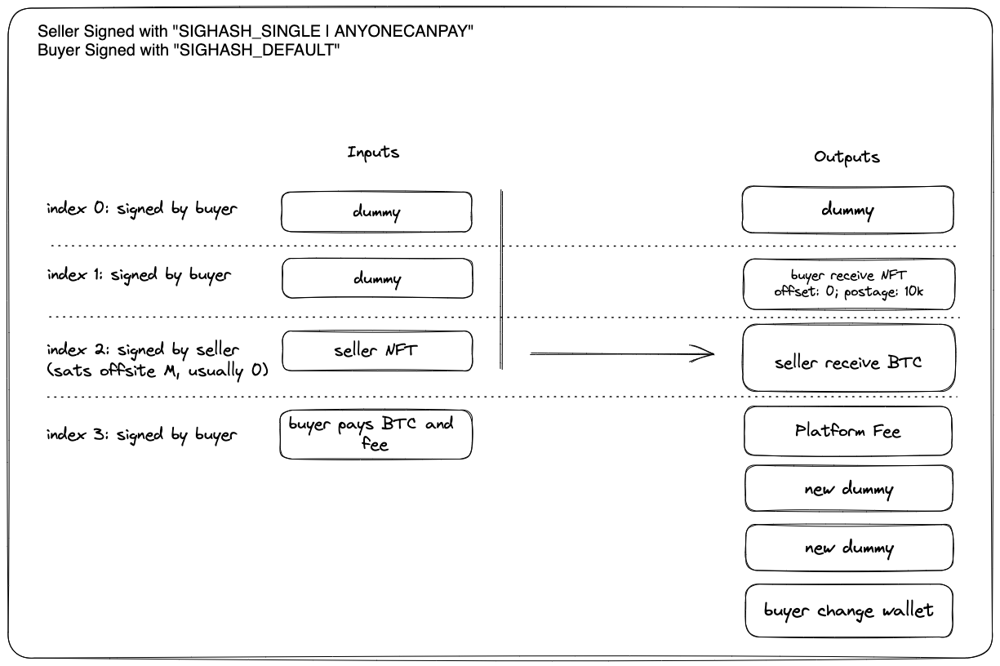

# Partially Signed Transactions

## Listing an Ordinal for Sale

You can create a PSBT to list a specific ordinal that you own for sale at a specific price where someone else can trustlessly complete the partially signed transaction with their inputs to pay the listed amount as well as their output script which the ordinal will be sent to. Code to do this can be found here: https://github.com/libsv/go-bt/blob/master/ord/list.go

This can allow for a Dutch auction where the seller can start at a price and keep decreasing until someone takes the offer.

To list an ordinal for sale, you just create a new Bitcoin transaction with 1 input (your ordinal utxo) and 1 output (where you want your payment to go with the listing amount) and sign with `SIGHASH_SIGNLE | SIGHASHANYONECANPAY` (using forkID). Here is an example:

```json
{
    "hex": "01000000016aced9aba38603b99a6660aaeed4119ced36540ed9e165c16ae41a36b17f028f000000006b4830450221008f321ff2fd9ae676203aae97c0f041ca0a4a99fd80d34efffa7406b65654e06002207ee3b7d45ec247cf83311dfe7984fa1cea830ca5abb438d9cba4534b52fc9fb3c32103b5a2ed046a33eeb504cbdd0aab9737f61a1b48178b284f40ae32b5efb71b89d4ffffffff01f4010000000000001976a9147921b5e173f5f664f566a9cd9514a1d0d85a76b688ac00000000",
    "txid": "a0574646e4fe5a42ae5a2f1ab6e77e1167e9107329f07dc19f816c8f50b32c8e",
    "hash": "a0574646e4fe5a42ae5a2f1ab6e77e1167e9107329f07dc19f816c8f50b32c8e",
    "size": 192,
    "version": 1,
    "locktime": 0,
    "vin": [
        {
            "n": 0,
            "txid": "8f027fb1361ae46ac165e1d90e5436ed9c11d4eeaa60669ab90386a3abd9ce6a",
            "vout": 0,
            "scriptSig": {
                "asm": "30450221008f321ff2fd9ae676203aae97c0f041ca0a4a99fd80d34efffa7406b65654e06002207ee3b7d45ec247cf83311dfe7984fa1cea830ca5abb438d9cba4534b52fc9fb3c3 03b5a2ed046a33eeb504cbdd0aab9737f61a1b48178b284f40ae32b5efb71b89d4",
                "hex": "4830450221008f321ff2fd9ae676203aae97c0f041ca0a4a99fd80d34efffa7406b65654e06002207ee3b7d45ec247cf83311dfe7984fa1cea830ca5abb438d9cba4534b52fc9fb3c32103b5a2ed046a33eeb504cbdd0aab9737f61a1b48178b284f40ae32b5efb71b89d4",
                "isTruncated": false
            },
            "sequence": 4294967295,
            "voutDetails": {
                "value": 1e-8,
                "n": 0,
                "scriptPubKey": {
                    "asm": "OP_DUP OP_HASH160 c25e9a2b70ec83d7b4fbd0f36f00a86723a48e6b OP_EQUALVERIFY OP_CHECKSIG OP_FALSE OP_IF 6f7264 OP_TRUE 746578742f706c61696e3b636861727365743d7574662d38 OP_FALSE 48656c6c6f2c20776f726c6421 OP_ENDIF",
                    "hex": "76a914c25e9a2b70ec83d7b4fbd0f36f00a86723a48e6b88ac0063036f72645118746578742f706c61696e3b636861727365743d7574662d38000d48656c6c6f2c20776f726c642168",
                    "type": "nonstandard",
                    "isTruncated": false
                },
                "scripthash": "0a45a232478e6e97f88487433fdb762eca3d8346174ec925f3d6d898e9764afc"
            }
        }
    ],
    "vout": [
        {
            "value": 0.000005,
            "n": 0,
            "scriptPubKey": {
                "asm": "OP_DUP OP_HASH160 7921b5e173f5f664f566a9cd9514a1d0d85a76b6 OP_EQUALVERIFY OP_CHECKSIG",
                "hex": "76a9147921b5e173f5f664f566a9cd9514a1d0d85a76b688ac",
                "reqSigs": 1,
                "type": "pubkeyhash",
                "addresses": [
                    "1C3V9TTJefP8Hft96sVf54mQyDJh8Ze4w4"
                ],
                "isTruncated": false
            },
            "scripthash": "80bd9afab38010571221a07495ba4601d052e8f5170c7fe9b076c5709f551a3a"
        }
    ],
    "vincount": 1,
    "voutcount": 1,
    "vinvalue": 1e-8,
    "voutvalue": 0.000005,
    "isUnknown": true
}
```

To accept the offer, you need to create a new tx, add 2 dummy inputs, the input from the PSBT above, then your input(s) to pay for the tx. Then 1 dummy output equal to the first 2 dummy input amounts (so those sats just passthrough), then your output for where to receive the ordinal, then the output from the PSBT above, then your change output(s), and then an optional platform fee. Then sign the rest of the inputs regularly (`SIGHASH_ALL`).

## Making a bid for an Ordinal

You can create a PSBT to bid at a specific price for a specific ordinal that someone else owns where they can accept the bid truslessly by completing the partially signed transaction. Code to do this can be found here: https://github.com/libsv/go-bt/blob/master/ord/bid.go

To bid at a price for a specific ordinal, you just create a new Bitcoin transaction (similar to the one above) but backwards. You add 2 dummy inputs, then the ordinal input, then your input(s); 1 dummy output (equal to the amount of the 2 dummy inputs), then your receive output, then dummy seller receive output, then change and platform fees. Then you sign all inputs except for the ordinal input (at index #2) with `SIGHASH_SIGNLE` (using forkID). Here is an example:

```json
{
    "hex": "0100000004d14b5f9fec20643a72bd8d1317ca54f3d76b9449d81e33fc0c384f3dd8841041000000006b483045022100f00de4c6d96351533d0ff8a3ed76d58843fbc164bff6a6710d5e7e8a87951c8b022011602fcb89acb69077e71ca2d0319d44e990335c4c34f8a5515c5b1c08e700ce432102c0d6375542a242e0e14f9d405e182a1f3602369a1651e57dcfd20f7edd39009fffffffffd14b5f9fec20643a72bd8d1317ca54f3d76b9449d81e33fc0c384f3dd8841041010000006a473044022030c089ca2cd6318870cc14a71980ec25a3d871143b4bd62a0d50487f5397fb20022030a7e280bc8793eeabffd864b3255ed998809bcecdc823b4beeb52081ad80d90432102c0d6375542a242e0e14f9d405e182a1f3602369a1651e57dcfd20f7edd39009fffffffff84a5788927871968b32bb2c8af735fd76e1b34d295339427046475c356787de151000000000000000056c4df06a8bfba996380e4c4fd5739ae086e5f28eb38b40c8140a739dc5a814d000000006a4730440220432e2480e39396f561e232d6b02193eae75370102c681739fca2701eb3177e1d0220294364dd611f3ff65332538309e9d5759831c2a21df3fb5b393d8532048583f5432102c0d6375542a242e0e14f9d405e182a1f3602369a1651e57dcfd20f7edd39009fffffffff0428000000000000001976a9145bd9baf4dc6270bad6e4152363bbeca2f5abc7c488ac01000000000000001976a9140f83a353705d800d13146bf4ad90510cc057a8d588acfa000000000000001976a91402d1e3d3567a88e0cfd13f57167238c4eb7c813888ace1dff505000000001976a9145bd9baf4dc6270bad6e4152363bbeca2f5abc7c488ac00000000",
    "txid": "c0a49982d08ed064c6822a27afc35c5c5910d001209ecc3f4868abbf43a9c1eb",
    "hash": "c0a49982d08ed064c6822a27afc35c5c5910d001209ecc3f4868abbf43a9c1eb",
    "size": 629,
    "version": 1,
    "locktime": 0,
    "vin": [
        {
            "n": 0,
            "txid": "411084d83d4f380cfc331ed849946bd7f354ca17138dbd723a6420ec9f5f4bd1",
            "vout": 0,
            "scriptSig": {
                "asm": "3045022100f00de4c6d96351533d0ff8a3ed76d58843fbc164bff6a6710d5e7e8a87951c8b022011602fcb89acb69077e71ca2d0319d44e990335c4c34f8a5515c5b1c08e700ce43 02c0d6375542a242e0e14f9d405e182a1f3602369a1651e57dcfd20f7edd39009f",
                "hex": "483045022100f00de4c6d96351533d0ff8a3ed76d58843fbc164bff6a6710d5e7e8a87951c8b022011602fcb89acb69077e71ca2d0319d44e990335c4c34f8a5515c5b1c08e700ce432102c0d6375542a242e0e14f9d405e182a1f3602369a1651e57dcfd20f7edd39009f",
                "isTruncated": false
            },
            "sequence": 4294967295,
            "voutDetails": {
                "value": 2e-7,
                "n": 0,
                "scriptPubKey": {
                    "asm": "OP_DUP OP_HASH160 5bd9baf4dc6270bad6e4152363bbeca2f5abc7c4 OP_EQUALVERIFY OP_CHECKSIG",
                    "hex": "76a9145bd9baf4dc6270bad6e4152363bbeca2f5abc7c488ac",
                    "reqSigs": 1,
                    "type": "pubkeyhash",
                    "addresses": [
                        "19NfKd8aTwvb5ngfP29RxgfQzZt8KAYtQo"
                    ],
                    "isTruncated": false
                },
                "scripthash": "0fcf4d75e02c6256453412ed2bcf5a34f5ce03fe58967a2241cfe341c269fb57"
            }
        },
        {
            "n": 1,
            "txid": "411084d83d4f380cfc331ed849946bd7f354ca17138dbd723a6420ec9f5f4bd1",
            "vout": 1,
            "scriptSig": {
                "asm": "3044022030c089ca2cd6318870cc14a71980ec25a3d871143b4bd62a0d50487f5397fb20022030a7e280bc8793eeabffd864b3255ed998809bcecdc823b4beeb52081ad80d9043 02c0d6375542a242e0e14f9d405e182a1f3602369a1651e57dcfd20f7edd39009f",
                "hex": "473044022030c089ca2cd6318870cc14a71980ec25a3d871143b4bd62a0d50487f5397fb20022030a7e280bc8793eeabffd864b3255ed998809bcecdc823b4beeb52081ad80d90432102c0d6375542a242e0e14f9d405e182a1f3602369a1651e57dcfd20f7edd39009f",
                "isTruncated": false
            },
            "sequence": 4294967295,
            "voutDetails": {
                "value": 2e-7,
                "n": 1,
                "scriptPubKey": {
                    "asm": "OP_DUP OP_HASH160 5bd9baf4dc6270bad6e4152363bbeca2f5abc7c4 OP_EQUALVERIFY OP_CHECKSIG",
                    "hex": "76a9145bd9baf4dc6270bad6e4152363bbeca2f5abc7c488ac",
                    "reqSigs": 1,
                    "type": "pubkeyhash",
                    "addresses": [
                        "19NfKd8aTwvb5ngfP29RxgfQzZt8KAYtQo"
                    ],
                    "isTruncated": false
                },
                "scripthash": "0fcf4d75e02c6256453412ed2bcf5a34f5ce03fe58967a2241cfe341c269fb57"
            }
        },
        {
            "n": 2,
            "txid": "e17d7856c375640427943395d2341b6ed75f73afc8b22bb3681987278978a584",
            "vout": 81,
            "scriptSig": {
                "asm": "",
                "hex": "",
                "isTruncated": false
            },
            "sequence": 0,
            "voutDetails": {
                "value": 1e-8,
                "n": 81,
                "scriptPubKey": {
                    "asm": "OP_DUP OP_HASH160 239d4c856f5bf3913a9bd27bb12763810fa89632 OP_EQUALVERIFY OP_CHECKSIG OP_FALSE OP_IF 6f7264 OP_TRUE 696d6167652f706e67 OP_FALSE 89504e470d0a1a0a0000000d49484452000001000000016008060000005486a73c00000006624b474400ff00ff00ffa0bda793000009b849444154789cedddd98f5e7501c6f16967da4e0b651784b014b008c85648a1405490a56aa2185903171ac38d01c1a86c0a0a189145b9c1c41bb8b086444924a261772111b114486823680003b2d336050bed4c3bf34efd231e9297e6f97cee1fce7be6ed7c3937bf332323000000000000000000000000000000c047cdac617f80bd76db6d5bb27f67c386a1df4362e18205d1fdbfbf79f350ef7fb79d768a3eff868d1bb7ebef6fc7f0fbfb60c8dfdfec615e1c182e0180620200c504008a0900141300282600504c00a0980040310180620200c504008a0900141300282600502c3e8b9c9ee73fe9a8a3a2eb3fb1664db44fdf27b0c72ebb44f7bfe4904f26f391175e7d35da6f9a9c88f6a71e7b5cb45ff5fcf3d1febf6fbf157d7ffbedb557f4fd2d3be288643ef2f8ead5d1feadf5eba3fbf70400c504008a0900141300282600504c00a0980040310180620200c504008a0900141300282600504c00a0980040b1a1ff6df643f63f203a8f7df6a9a746d75ff1e003d17e7ceedc683f31b925da5f7cd659d17e7a3088f6f73ef6d768bf79227b1fc1f8bc79d1fe9ccf9d16ed573c707fb47f7deddaa1fe0e7a0280620200c504008a0900141300282600504c00a0980040310180620200c504008a0900141300282600504c00a0587c16f9d0458ba2f3fcdff8d297a3ebdf79dfefa37d7a9effb2f32e88f66fac5b1bed7f159e471f9d9dfd3fe0e2b3be12ed27b664ef43b8fba107a3fdfc79e3d1fec2e5cba3fd5d7fb82fdabff8da6bd1efb02700282600504c00a0980040310180620200c504008a0900141300282600504c00a0980040310180620200c504008a8da5ff817fbff24a741ef9378f3c1cbd4fe085575f8dae7ff4e2c5d1f5f7dc6dd7643e3232125d7e64febc79d17e41781e7e301844fbdd77de39daa7e7f9d7bcf462f4ef67febcb9d117989ee74f790280620200c504008a0900141300282600504c00a0980040310180620200c504008a0900141300282600504c00a0d850cf227f18961e7e78741efbb2f3ce8fae3f3696bd5261d3e689687fd8810746fbd7de793bda2fde6fbf68ffdefb1f44fb9d17ee18ed2fb9f5d668ffe473ffdcae7f873c0140310180620200c504008a0900141300282600504c00a0980040310180620200c504008a0900141300282600506cbb3ecbfc615876c411d1fb046666a2f9c89cf07d02dfb9f0c2687fc8fe0744fbcb7e7e5bb4df3a3515edb39ffec8c8136bd654ff0e780280620200c504008a0900141300282600504c00a0980040310180620200c504008a0900141300282600504c00a058f559e80fc329c71d171d49bfe7273745d7ffea555746fb05e3e3d1fed7d7df18edcfbff6fbd1feb1679ef16f38e009008a0900141300282600504c00a0980040310180620200c504008a0900141300282600504c00a098004031018062433f4b7df2d14747e7e9ffbe7af5d0ef2171c6f1c747f7ffe8aa5543bdffe5cb4e8c3effc32bffb15d7f7fcb972d0bef7fe550efdf1300141300282600504c00a0980040310180620200c504008a0900141300282600504c00a0980040310180620200c5c6d2ffc0e74fccce83ffe27b5744d7ffe62d370ff53cfd694b9746d75f71fd0dc97ce4a21f5e175d7f7a7a105dff964b2f8df653d353d1e7ffcbd34f47dfdfe94bb3f731dcf6adcb93f9c8f460105dffcf4f3d15ddbf2700282600504c00a0980040310180620200c504008a0900141300282600504c00a0980040310180620200c504008ac5ef03d83c3919ed376eda14ed67cf1e8df69f59b2243a8f7df70d3f8eaeffb15d7789f673c6b2af7034fcf91db8cf3ed1fe9e9b7e1aedcfbefaaaec7d0883ec7d08471e7c70b4df3a351ded539e00a0980040310180620200c504008a0900141300282600504c00a0980040310180620200c504008a09001413002816bf0f60c1bcf1687fe4c19f88f663a3d979f6db2fff76b4bfe847d745fbd1d95983efb9e9e668ffdefb1ba3fdb9d75c1dedb74c4d45fb3ffeecf6687fc1b53f88f66fae5f17edc7e7ce8df6294f00504c00a0980040310180620200c504008a0900141300282600504c00a0980040310180620200c504008a0900149b35ec0f70fad2e3a3bfeffea7a75645f7f0e9638e89aeffb7679f1deacff094638f8b3eff6066105d7fd8f7bf7cd9b2e8fe1f5eb932fafc679e704274fd479e7c72a83f3f4f00504c00a0980040310180620200c504008a0900141300282600504c00a0980040310180620200c504008a0900141bfafb00daa5ef23b8e3bb5744d75ffbeebbd1fec6bbee8cf68faf1eeefb04da790280620200c504008a0900141300282600504c00a0980040310180620200c504008a0900141300282600504c00a098b3d8a1f43cff355ffb7a74fd83f7dd37dacfcccc44fb77366c88f657fee28e68bfeab9e7fc1b0e780280620200c504008a0900141300282600504c00a0980040310180620200c504008a0900141300282600504c00a0d8d8b03fc0f66ecbd454b47f73fdfa68bf70c10ed17efdffde8bf6fbeeb967b41f0c06d19e8c2700282600504c00a0980040310180620200c504008a0900141300282600504c00a0980040310180620200c504008ad5ff6df5a5871dbe2dd94f4e6d8dae3f672c7b25c396add9f5c7e7ce8bf6dbb6453fbe9189ad5ba2fd9cd1d168bfe6a597aa7f073c0140310180620200c504008a0900141300282600504c00a0980040310180620200c504008a0900141300282600502c3b8cfe1170e8a245d181f4f3cf3823bafe1bebd645fb5d162e8cf6bf7df491683f353d15edcf3f3dfbf94d86ef33d875a79da2fd8a07ee8ffefd3cfbc20bdbf5fb043c0140310180620200c504008a0900141300282600504c00a0980040310180620200c504008a0900141300282600506cec808fef1d9d879e1e4c471f60fef878b4ffec9225d17ef3e464b49f9aceee7fc503f747fb2f9c7852b49f3396bd12e297f7fe2eda7ff1a493a37dfafd2d3f6159b4dfb86953f4fb336734fbf94f6cc9eedf1300141300282600504c00a0980040310180620200c504008a0900141300282600504c00a0980040310180620200c5665d72ceb9d179e697df7c33fa0073e7cc89f6839941b49f98dc12ed17edbd77b47f68e5ca68bf797222dacf9a95fd79fb996dd13f9f91338f3f21da2f08df27f19f375e8ff6a3b347a3fda70e3a28daffeb9597a3bd2700282600504c00a0980040310180620200c504008a0900141300282600504c00a0980040310180620200c504008acd5abcdffed181eeb9e1df979f19c9ce93bffeceda689fbe4f6087f9f3a3fdb6f03cfddebbef11eda706d3d1fead75eba3fdccb699689fbe4f62eb7476ffc72c5e1ced531b376d8af69e00a0980040310180620200c504008a0900141300282600504c00a0980040310180620200c504008a090014130028f67f41969ba56c7ec1440000000049454e44ae426082 OP_ENDIF OP_RETURN 3150755161374b36324d694b43747373534c4b79316b683536575755374d74555235 534554 74797065 6f7264 636f6c6c656374696f6e 734d6f6e 617070 74616c656f6673687561 6d6f6e54797065 726f626f74 617564696f 623a2f2f35363636636634343235306234333838316433313233366336616265623936616134633762666466663737613033396462353665643239363339306430373638 7374617473 7b22737472656e677468223a352c22766974616c697479223a342c226167696c697479223a332c22696e74656c6c6967656e6365223a362c226c75636b223a342c22737069726974223a387d 67756964 65613365393162302d633662362d313165642d393436332d353932336262613136366666",
                    "hex": "76a914239d4c856f5bf3913a9bd27bb12763810fa8963288ac0063036f72645109696d6167652f706e67004d030a89504e470d0a1a0a0000000d49484452000001000000016008060000005486a73c00000006624b474400ff00ff00ffa0bda793000009b849444154789cedddd98f5e7501c6f16967da4e0b651784b014b008c85648a1405490a56aa2185903171ac38d01c1a86c0a0a189145b9c1c41bb8b086444924a261772111b114486823680003b2d336050bed4c3bf34efd231e9297e6f97cee1fce7be6ed7c3937bf332323000000000000000000000000000000c047cdac617f80bd76db6d5bb27f67c386a1df4362e18205d1fdbfbf79f350ef7fb79d768a3eff868d1bb7ebef6fc7f0fbfb60c8dfdfec615e1c182e0180620200c504008a0900141300282600504c00a0980040310180620200c504008a0900141300282600502c3e8b9c9ee73fe9a8a3a2eb3fb1664db44fdf27b0c72ebb44f7bfe4904f26f391175e7d35da6f9a9c88f6a71e7b5cb45ff5fcf3d1febf6fbf157d7ffbedb557f4fd2d3be288643ef2f8ead5d1feadf5eba3fbf70400c504008a0900141300282600504c00a0980040310180620200c504008a0900141300282600504c00a0980040b1a1ff6df643f63f203a8f7df6a9a746d75ff1e003d17e7ceedc683f31b925da5f7cd659d17e7a3088f6f73ef6d768bf79227b1fc1f8bc79d1fe9ccf9d16ed573c707fb47f7deddaa1fe0e7a0280620200c504008a0900141300282600504c00a0980040310180620200c504008a0900141300282600504c00a0587c16f9d0458ba2f3fcdff8d297a3ebdf79dfefa37d7a9effb2f32e88f66fac5b1bed7f159e471f9d9dfd3fe0e2b3be12ed27b664ef43b8fba107a3fdfc79e3d1fec2e5cba3fd5d7fb82fdabff8da6bd1efb02700282600504c00a0980040310180620200c504008a0900141300282600504c00a0980040310180620200c504008a8da5ff817fbff24a741ef9378f3c1cbd4fe085575f8dae7ff4e2c5d1f5f7dc6dd7643e3232125d7e64febc79d17e41781e7e301844fbdd77de39daa7e7f9d7bcf462f4ef67febcb9d117989ee74f790280620200c504008a0900141300282600504c00a0980040310180620200c504008a0900141300282600504c00a0d850cf227f18961e7e78741efbb2f3ce8fae3f3696bd5261d3e689687fd8810746fbd7de793bda2fde6fbf68ffdefb1f44fb9d17ee18ed2fb9f5d668ffe473ffdcae7f873c0140310180620200c504008a0900141300282600504c00a0980040310180620200c504008a0900141300282600506cbb3ecbfc615876c411d1fb046666a2f9c89cf07d02dfb9f0c2687fc8fe0744fbcb7e7e5bb4df3a3515edb39ffec8c8136bd654ff0e780280620200c504008a0900141300282600504c00a0980040310180620200c504008a0900141300282600504c00a058f559e80fc329c71d171d49bfe7273745d7ffea555746fb05e3e3d1fed7d7df18edcfbff6fbd1feb1679ef16f38e009008a0900141300282600504c00a0980040310180620200c504008a0900141300282600504c00a098004031018062433f4b7df2d14747e7e9ffbe7af5d0ef2171c6f1c747f7ffe8aa5543bdffe5cb4e8c3effc32bffb15d7f7fcb972d0bef7fe550efdf1300141300282600504c00a0980040310180620200c504008a0900141300282600504c00a0980040310180620200c5c6d2ffc0e74fccce83ffe27b5744d7ffe62d370ff53cfd694b9746d75f71fd0dc97ce4a21f5e175d7f7a7a105dff964b2f8df653d353d1e7ffcbd34f47dfdfe94bb3f731dcf6adcb93f9c8f460105dffcf4f3d15ddbf2700282600504c00a0980040310180620200c504008a0900141300282600504c00a0980040310180620200c504008ac5ef03d83c3919ed376eda14ed67cf1e8df69f59b2243a8f7df70d3f8eaeffb15d7789f673c6b2af7034fcf91db8cf3ed1fe9e9b7e1aedcfbefaaaec7d0883ec7d08471e7c70b4df3a351ded539e00a0980040310180620200c504008a0900141300282600504c00a0980040310180620200c504008a09001413002816bf0f60c1bcf1687fe4c19f88f663a3d979f6db2fff76b4bfe847d745fbd1d95983efb9e9e668ffdefb1ba3fdb9d75c1dedb74c4d45fb3ffeecf6687fc1b53f88f66fae5f17edc7e7ce8df6294f00504c00a0980040310180620200c504008a0900141300282600504c00a0980040310180620200c504008a0900149b35ec0f70fad2e3a3bfeffea7a75645f7f0e9638e89aeffb7679f1deacff094638f8b3eff6066105d7fd8f7bf7cd9b2e8fe1f5eb932fafc679e704274fd479e7c72a83f3f4f00504c00a0980040310180620200c504008a0900141300282600504c00a0980040310180620200c504008a0900141bfafb00daa5ef23b8e3bb5744d75ffbeebbd1fec6bbee8cf68faf1eeefb04da790280620200c504008a0900141300282600504c00a0980040310180620200c504008a0900141300282600504c00a098b3d8a1f43cff355ffb7a74fd83f7dd37dacfcccc44fb77366c88f657fee28e68bfeab9e7fc1b0e780280620200c504008a0900141300282600504c00a0980040310180620200c504008a0900141300282600504c00a0d8d8b03fc0f66ecbd454b47f73fdfa68bf70c10ed17efdffde8bf6fbeeb967b41f0c06d19e8c2700282600504c00a0980040310180620200c504008a0900141300282600504c00a0980040310180620200c504008ad5ff6df5a5871dbe2dd94f4e6d8dae3f672c7b25c396add9f5c7e7ce8bf6dbb6453fbe9189ad5ba2fd9cd1d168bfe6a597aa7f073c0140310180620200c504008a0900141300282600504c00a0980040310180620200c504008a0900141300282600502c3b8cfe1170e8a245d181f4f3cf3823bafe1bebd645fb5d162e8cf6bf7df491683f353d15edcf3f3dfbf94d86ef33d875a79da2fd8a07ee8ffefd3cfbc20bdbf5fb043c0140310180620200c504008a0900141300282600504c00a0980040310180620200c504008a0900141300282600506cec808fef1d9d879e1e4c471f60fef878b4ffec9225d17ef3e464b49f9aceee7fc503f747fb2f9c7852b49f3396bd12e297f7fe2eda7ff1a493a37dfafd2d3f6159b4dfb86953f4fb336734fbf94f6cc9eedf1300141300282600504c00a0980040310180620200c504008a0900141300282600504c00a0980040310180620200c5665d72ceb9d179e697df7c33fa0073e7cc89f6839941b49f98dc12ed17edbd77b47f68e5ca68bf797222dacf9a95fd79fb996dd13f9f91338f3f21da2f08df27f19f375e8ff6a3b347a3fda70e3a28daffeb9597a3bd2700282600504c00a0980040310180620200c504008a0900141300282600504c00a0980040310180620200c504008acd5abcdffed181eeb9e1df979f19c9ce93bffeceda689fbe4f6087f9f3a3fdb6f03cfddebbef11eda706d3d1fead75eba3fdccb699689fbe4f62eb7476ffc72c5e1ced531b376d8af69e00a0980040310180620200c504008a0900141300282600504c00a0980040310180620200c504008a090014130028f67f41969ba56c7ec1440000000049454e44ae426082686a223150755161374b36324d694b43747373534c4b79316b683536575755374d74555235035345540474797065036f72640a636f6c6c656374696f6e04734d6f6e036170700a74616c656f6673687561076d6f6e5479706505726f626f7405617564696f44623a2f2f353636366366343432353062343338383164333132333663366162656239366161346337626664666637376130333964623536656432393633393064303736380573746174734c4c7b22737472656e677468223a352c22766974616c697479223a342c226167696c697479223a332c22696e74656c6c6967656e6365223a362c226c75636b223a342c22737069726974223a387d04677569642465613365393162302d633662362d313165642d393436332d353932336262613136366666",
                    "type": "nonstandard",
                    "isTruncated": false
                },
                "scripthash": "8fd47ee61222d2a37f3732754a3a7fb07caf813bfb618365404c638b5004bb03"
            }
        },
        {
            "n": 3,
            "txid": "4d815adc39a740810cb438eb285f6e08ae3957fdc4e4806399babfa806dfc456",
            "vout": 0,
            "scriptSig": {
                "asm": "30440220432e2480e39396f561e232d6b02193eae75370102c681739fca2701eb3177e1d0220294364dd611f3ff65332538309e9d5759831c2a21df3fb5b393d8532048583f543 02c0d6375542a242e0e14f9d405e182a1f3602369a1651e57dcfd20f7edd39009f",
                "hex": "4730440220432e2480e39396f561e232d6b02193eae75370102c681739fca2701eb3177e1d0220294364dd611f3ff65332538309e9d5759831c2a21df3fb5b393d8532048583f5432102c0d6375542a242e0e14f9d405e182a1f3602369a1651e57dcfd20f7edd39009f",
                "isTruncated": false
            },
            "sequence": 4294967295,
            "voutDetails": {
                "value": 1,
                "n": 0,
                "scriptPubKey": {
                    "asm": "OP_DUP OP_HASH160 5bd9baf4dc6270bad6e4152363bbeca2f5abc7c4 OP_EQUALVERIFY OP_CHECKSIG",
                    "hex": "76a9145bd9baf4dc6270bad6e4152363bbeca2f5abc7c488ac",
                    "reqSigs": 1,
                    "type": "pubkeyhash",
                    "addresses": [
                        "19NfKd8aTwvb5ngfP29RxgfQzZt8KAYtQo"
                    ],
                    "isTruncated": false
                },
                "scripthash": "0fcf4d75e02c6256453412ed2bcf5a34f5ce03fe58967a2241cfe341c269fb57"
            }
        }
    ],
    "vout": [
        {
            "value": 4e-7,
            "n": 0,
            "scriptPubKey": {
                "asm": "OP_DUP OP_HASH160 5bd9baf4dc6270bad6e4152363bbeca2f5abc7c4 OP_EQUALVERIFY OP_CHECKSIG",
                "hex": "76a9145bd9baf4dc6270bad6e4152363bbeca2f5abc7c488ac",
                "reqSigs": 1,
                "type": "pubkeyhash",
                "addresses": [
                    "19NfKd8aTwvb5ngfP29RxgfQzZt8KAYtQo"
                ],
                "isTruncated": false
            },
            "scripthash": "0fcf4d75e02c6256453412ed2bcf5a34f5ce03fe58967a2241cfe341c269fb57"
        },
        {
            "value": 1e-8,
            "n": 1,
            "scriptPubKey": {
                "asm": "OP_DUP OP_HASH160 0f83a353705d800d13146bf4ad90510cc057a8d5 OP_EQUALVERIFY OP_CHECKSIG",
                "hex": "76a9140f83a353705d800d13146bf4ad90510cc057a8d588ac",
                "reqSigs": 1,
                "type": "pubkeyhash",
                "addresses": [
                    "12R2qFEoUtWwwVecgrkxwMZNnMq6GB8pQW"
                ],
                "isTruncated": false
            },
            "scripthash": "d1bfc516c16ca37cf1d40c91b9e901ddfe2da400ede23b3ddb06da1eebc03feb"
        },
        {
            "value": 0.0000025,
            "n": 2,
            "scriptPubKey": {
                "asm": "OP_DUP OP_HASH160 02d1e3d3567a88e0cfd13f57167238c4eb7c8138 OP_EQUALVERIFY OP_CHECKSIG",
                "hex": "76a91402d1e3d3567a88e0cfd13f57167238c4eb7c813888ac",
                "reqSigs": 1,
                "type": "pubkeyhash",
                "addresses": [
                    "1FunnyJoke111111111111111112AVXh5"
                ],
                "isTruncated": false
            },
            "scripthash": "2dbf8c03f51117c6f34a1803ff569b4a446bb4464b13c06e8f939b42d336ef82"
        },
        {
            "value": 0.99999713,
            "n": 3,
            "scriptPubKey": {
                "asm": "OP_DUP OP_HASH160 5bd9baf4dc6270bad6e4152363bbeca2f5abc7c4 OP_EQUALVERIFY OP_CHECKSIG",
                "hex": "76a9145bd9baf4dc6270bad6e4152363bbeca2f5abc7c488ac",
                "reqSigs": 1,
                "type": "pubkeyhash",
                "addresses": [
                    "19NfKd8aTwvb5ngfP29RxgfQzZt8KAYtQo"
                ],
                "isTruncated": false
            },
            "scripthash": "0fcf4d75e02c6256453412ed2bcf5a34f5ce03fe58967a2241cfe341c269fb57"
        }
    ],
    "vincount": 4,
    "voutcount": 4,
    "vinvalue": 1.00000041,
    "voutvalue": 1.00000004,
    "isUnknown": true
}
```

To accept the bid, you need to replace the dummy script in output at index #2 with the script that you want the money to go to and then sign the ordinal input regularly (`SIGHASH_ALL`).

### &#x20;Example diagram from [Magic Eden OSS docs](https://github.com/magiceden-oss/msigner/blob/main/docs/psbt.excalidraw.png):

<figure><figcaption></figcaption></figure>
